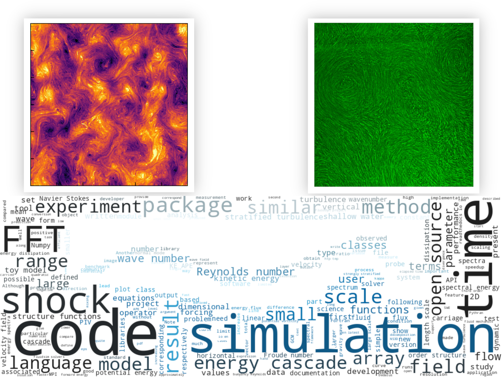
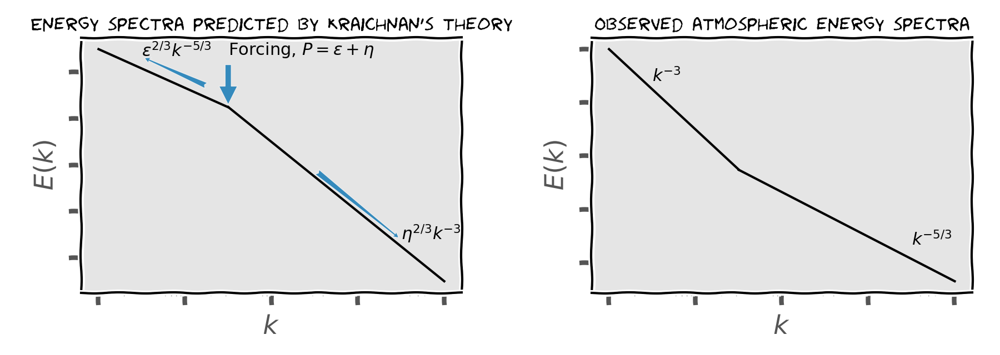
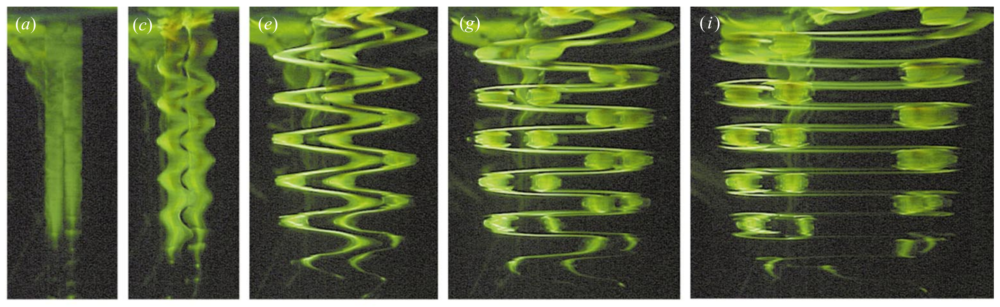

### {.plain .noframenumbering}

<div id="fig:">


{height=35%}\hfill
{height=35%}

```{=latex}
\\[-2ex]
```

{width=42%}

The big picture

</div>

# Part 1: Two dimensional models of geophysical turbulence

## Background

:::::::::::::::: {.columns}
::: {.column width="50%"}

**Atmospheric energy spectrum**^[@NastromGage1985 © AMS]

{height=90%}
<!-- {width=80% height=60%} -->


:::
::: {.column width="50%"}

. . .


Two inertial ranges, separated by scales:

\ 

- planetary / synoptic scales $E(k) \sim k^{-3}$
  {width=70% height=28%}


. . .

- mesoscales $E(k) \sim k^{-5/3}$
  {width=70% height=28%}


:::
:::::::::::::::::::::::::::::

. . .

\centering{\alert{How do we theorize the mechanism behind these two inertial ranges?}}

### Two-dimensional turbulence

Kraichnan's theory of 2D turbulence[^kraichnan]

- **Vorticity** and **enstrophy** conservation: a strong constraint on cascade

- Dual cascade:
$$E(k) \sim \epsilon^{2/3}k^{-5/3},\quad E(k) \sim \eta^{2/3}k^{-3}$$

. . .

- Directions of cascades:

  - $k^{-5/3}$ range: constant energy flux[^kolmo] $\epsilon$, **inverse** cascade

  - $k^{-3}$ range: constant enstrophy flux $\eta$, **forward** cascade

. . .

- Spatial scales of inertial ranges: "a paradox"[^frisch]
  {height=50%}

[^kraichnan]: @Kraichnan1967
[^kolmo]: Similar to scaling due to @Kolmogorov1941, @obukhov1941distribution and @obukhov1941spectral
[^frisch]: @Frisch

### Possible explanations of mesoscale spectrum

#### Hypotheses for cascade directions {.cbox}

- @Gage:1979 & @Lilly:1983: **inverse energy cascade** as in @Kraichnan1967

- @Dewan:1979: **forward energy cascade** as in @Kolmogorov1941

#### {.endblock}

. . .

#### Vertical resolutions {.cbox}

* @Waite-Bartello:2004 and @Lindborg2006 : **stratified turbulence**. $l_v \sim u/N \approx 1 \text{km}$. 
* @Buhler-Callies-Ferrari:2014 : **inertia gravity waves**. Frequency
  $\omega \approx f$. i.e. $l_v \approx$ 100 metres.

#### {.endblock}

. . .

\ 

::::::::::::::::::::::::::::: {.columns}

::: {.column width=40%}

DNS of stratified turbulence supports:
^[@Lindborg2006 ]


* $k^{-5/3}$ spectrum

- **forward cascade**

- **fine vertical resolution** requirement

:::
::: {.column}

. . .

General circulation models^[@Augier-Lindborg:2013] shows:

* $k^{-5/3}$ spectrum

- **forward cascade** in mesoscales

- with **coarse resolution**: 24 pressure levels along vertical

:::
:::::::::::::::::::::::::::::::::::::::::

. . .

\centering{{\alert{Minimum number of vertical levels? Is it possible with a single level model?}}}

### Quasi geostrophic equation

Quasi-geostrophic equation^[@Charney1971] conserves an approximate *potential vorticity*:
  $$\Dt{q} = 0,$$
  $$ q = \nabla^2 \psi + \frac{\alert<2>{f_0}^2}{\tilde \rho}
  \left(\frac{\tilde \rho}{\alert<3>{N^2}} \alert<3>{\p_z \psi} \right) + \alert<2>{\beta} y, $$

. . .

- Incorporates [rotation]{alert="<2>"} and [stratification]{alert="<3>"} in a 2D model

- <4-> Bridging **ideal 2D turbulence** to **atmospheric turbulence**

- <5-> Valid for **strong rotation**, lengths scales **smaller than
  planetary** scales

- <6-> No ageostrophic motion, for example: **inertial gravity waves**

- <7-> Reproduces $k^{-3}$ spectrum

\ 

<7-> \centering{{\alert{What about the $k^{-5/3}$ mesoscale spectrum?}}}

## Shallow water equations

### Properties of shallow water equations

#### Governing equations

::: notes

- Inviscid equations conserves in a periodic domain (no boundary fluxes)

:::

::::::::::{.columns}
:::{.column width=50%}

  \begin{align*}
  \partial_t \alert<2>{\mathbf{u}} &= - (\alert<2>{\mathbf{u}}.\nabla) \alert<2>{\mathbf{u}}
      - \alert<3>c^2 \nabla \alert<5>h - \alert<4>f\mathbf{e_z} \times \alert<2>{\mathbf{u}}, \\
  \partial_t \alert<5>h &= - \nabla \cdot (\alert<5>h \alert<2>{\mathbf{u}}).
  \end{align*}

- where,

  + <2-> $\alert<2>{\mathbf{u}}=$ horizontal velocity vector,
  + <3-> $\alert<3>{c} =$ wave speed,
  + <4-> $\alert<4>f$ = Coriolis parameter,
  + <5-> $\alert<5>{h} = H + \eta$, height of fluid^[@vallis_atmospheric_2017].

:::
:::{.column width=50%}

<5-> {width=100% height=40%}
:::
:::::::::::::::::::

\onslide<6->


#### with **good properties** {.gbox}

  + Conserves **energy** $E = E_K + E_P$ and the sum $E_K + E_A$, where $E_A =$ available potential energy (A.P.E.) 
  + Conserves **potential vorticity**, $Q = (\zeta + f)/h$
  + Equipartition of $E_K$ and $E_A$ over a wave period
  
#### {.endblock}

\onslide<7->

#### and some **downsides** {.rbox}

  + Waves $\to$ shocks
  + Cubic $E_K = h\mathbf{u.u} / 2$

#### {.endblock}

### Results: Energy cascade 1^[ @augier_shallow_2019 ]


#### SW analogue of @Kolmogorov1941's $\frac{4}{5}$ law for $3^{rd}$-order structure function {.cbox}
  \begin{equation*}
  \meane{ |\delta \uu|^2 \delta J_L }
  + c^2\meane{ (\delta h)^2 \delta u_L } = -4 \epsilon r,
  \end{equation*}

- $\epsilon =$ energy flux or dissipation; $r =$ separation distance
- $J_L \equiv h u_L$ and $u_L \equiv \uu\cdot\rr / |\rr|$ are longitudinal momentum and velocities
- positive flux ($\epsilon > 0$) $\Rightarrow$ **forward energy** cascade

#### {.endblock}

. . .

{height=50%}


### Results: Shock waves^[ @augier_shallow_2019 ]

{width=60%
height=80%}

### Results: Spectra and higher-order statistics^[ @augier_shallow_2019 ]

#### Scaling laws for shock dominated turbulence {.cbox}

- <+-> Shock amplitudes, $| \Delta u | \sim | c \Delta h | \sim (\epsilon d)^{1/3}$

- <+-> $p^{th}$-order structure functions
  $$\meane{|\delta u |^p}  \sim \meane{(c|\delta h |)^p} \sim  (\epsilon
  d)^{p/3} \,  \frac{r}{d}$$

- <+-> $p = 2 \Rightarrow$ energy spectra: $E_K(k) \sim  E_A(k) \sim \epsilon ^{2/3} d^{-1/3} k^{-2}$

#### {.endblock}

. . .

<div id="fig:scaling">

{#fig:D width=48% height=40%}
{#fig:E width=48% height=40%}

Shock separation $d$ and energy spectra $E(k)$ scaling
</div>

## Toy model equations

### Derivation of toy model equations^[@LindborgMohanan2017]

::: notes

with $\Psi$ and $\chi$ being the **stream function** and the **velocity potential** respectively.

:::

#### Helmholtz decomposition

$${\bf u} = \bf{u}_r + \bf{u}_d$$

 * ${\bf u}_r  = -\nabla \times ( {\bf e_z} \Psi)$ is the rotational component
 * $\bf {u}_d = \nabla \chi$ is the divergent component


. . .

#### Governing equations

- Starting from classical shallow water equations,

#### Assumptions & modifications {.cbox}

- <2-> [**Surface displacement much smaller**]{alert="<2>"} compared to the mean fluid layer
  height, $\eta << 1$.

- <4-> Velocities in the large scale are [**dominated by rotational part**]{alert="<4>"},
  $|\bf u_r| >> |\bf u_d|$.

- <6-> [**Substitute**]{alert="<6>"} $c\eta$ with $\theta$ (optional).


#### {.endblock}

\begin{align*}
\frac{\partial {\bf u}} {\partial t} + {
  \color<4>{purple}\only<-4>{{\uu}\, \cdot\, \nabla}
  \color<5->{teal}\only<5->{{\uu_r}\cdot \nabla}
  }
  {\bf u} +
  f {\bf e}_z \times {\bf u} &=
  \color<6>{purple}\only<-6>{-c^2 \nabla \eta} %
  \color<7->{teal}\only<7->{-c \nabla \theta} %
  \\
\frac{\partial 
  \color<6>{purple}\only<-6>\eta
  \color<7->{teal}\only<7->\theta
}{\partial t}+ {
  \color<4>{purple}\only<-4>{{\uu}\, \cdot\, \nabla}
  \color<5->{teal}\only<5->{{\uu_r}\cdot \nabla}
  }
  \color<6>{purple}\only<-6>\eta
  \color<7->{teal}\only<7->\theta
  &= -
  \color<7->{teal}\only<7->c
  \color<2>{purple}\only<2>{(1+\eta) \nabla \cdot {\bf u}}
  \color<3->{teal}\only<3->{\nabla \cdot {\bf u}}
\end{align*}

- <7-> \color{teal}{Q.E.D.}

### A good compromise^[@LindborgMohanan2017]

#### Pros {.gbox}

- **No shocks**

- Kinetic and available potential energies are **quadratic** and conserved

- **Linearised potential vorticity** $q$ conserved in the limit of strong rotation $Ro \to 0$, where $q=\zeta - f \eta$

#### {.endblock}

#### Cons {.rbox}

-  **Full potential vorticity** $Q$ is not exactly conserved

#### {.endblock}

::::::::::::::::::::::: {.columns}
:::::::::: {.column width=58%}

\centering{%
  

<div id="fig:spectratoy">

{height=75% #fig:speck6}
{height=75% #fig:speck30}

Time averaged energy spectra from two simulations by forcing at
(a) $k_f = 6\delta k$
(b) $k_f = 30\delta k$

</div>

:::
:::::::::: {.column}

#### Highlights

- Legend
  + $E_K =$ `{\color{red}{kinetic energy}}`{=latex}
  + $E_A =$ `{\color{blue}{available potential energy}}`{=latex}
  + $E_V =$ `{\color{violet}{vortical energy}}`{=latex}
  + $E_W =$ `{\color{teal}{wave energy}}`{=latex}

- $E_W \sim k^{-5/3}$
- $E_V \sim k^{-3}$
- Equipartition between $E_K$ and $E_A$

:::
::::::::::::::::::::::::

---

::: notes

The total spectral energy flux $\Pi$
has been decomposed into kinetic ($\Pi_K$) and available potential energy
($\Pi_A$) energy fluxes. The conversion from available potential energy to
kinetic energy is represented by $C_{cum}$. The kinetic energy flux is further
decomposed as $\Pi_{2D}$, the flux due to geostrophic modes and the difference
$\Pi_K - \Pi_{2D}$.

:::

:::::::::::: {.columns}
::: {.column width="55%"}

#### Spectral energy budget

- **Spectral energy flux**, 
$\Pi(\mathbf{k},t) = \int_0^{\infty} T(\mathbf{k}',t) d\mathbf{k}'$

. . .

- $T=T_K + T_A$ are **transfer functions**,
  \begin{align*}
  \partial_t E_K(\mathbf{k},t) 
    &= \text{\textonehalf} \partial_t (\hat{\uu}\hat{\uu}^*)
    = T_K + C_K
    ,\quad\\
  \partial_t E_A(\mathbf{k},t) 
    &= \text{\textonehalf} \partial_t (\hat{\theta}\hat {\theta}^*)
    = T_A + C_A 
  \end{align*}
  which for the toy model equations
  are derived as $T_K=  \Im\left[\hat{u}_i^* k_j \widehat{u^r_j u_i}\right],\quad
  T_A  =  \Im\left[\hat{\theta}^* k_j \widehat{u^r_j \theta}\right]$.

:::
::: {.column}

. . .

#### Normal mode decomposition


- Linearization and diagonalization of the toy model equations yields the
  **normal modes**:
  \begin{align*}
      \mathbf{B}
      = & \frac{1}{\sqrt{2}\sigma}
      \begin{Bmatrix} \sqrt{2} c\left(-
          \kappa^{2} \hat \psi +  f\hat\eta \right)               \\
          \kappa \left(c^{2} \eta + f \hat{\psi} + i \hat{\chi} \sigma\right) \\
          \kappa \left(c^{2} \eta + f \hat{\psi} - i \hat{\chi} \sigma\right)
      \end{Bmatrix}.
  \end{align*}
  which can be transformed to $\mathbf{U} = \{\hat{u}_x,\hat{u}_y, \hat{\theta}\}^T$.

:::
:::::::::::::::::::::::::::::::::

. . .

{height=52%}

### Comparison of a GCM^[@Augier-Lindborg:2013] with the toy model^[@LindborgMohanan2017] 
<div id="fig:sebgcmtoy">

{width=50% height=60% #fig:sebgcm}
{width=50% height=55% #fig:sebtoy}

Spectral energy budgets from (a) GCM and (b) toy model simulations. 

</div>

where, $\Pi_{2D} \equiv \Pi_{VVV}$.


# Part 2: MILESTONE experiment


## Motivation
- Strongly stratified turbulence regime characterized  by
  $$
  F_h = \frac{\epsK}{NU^2} \ll 1,\text{ and } \R = ReF_h^2 = \frac{\epsK}{\nu N^2} > 10.
  $$
- \pause Mixing efficiency ($\eta$) or mixing coefficient ($\Gamma$) are defined as:
  $$
  \eta = \epsP / (\epsK + \epsP),\quad \Gamma = \epsP / \epsK,
  $$
  and widely used to parametrize ocean eddy-diffusivity turbulence models.
- \pause Verify results from stratified turbulence theories:

. . .

::::::::::: {.columns}
::: {.column}



:::
::: {.column width="50%"}


1. **layered structures** with $l_v \sim u/N$^[@billant_experimental_2000]

\ 

. . .

2. **forward energy cascade** with spectrum^[@Lindborg2006] $E(k) \sim \epsilon^{2/3}
   k^{-5/3}$, or
   $2^{nd}$-order structure function scaling^[@ChoLindborg2001] as
   $\langle\delta \mathbf{u}.  \delta \mathbf{u}\rangle \sim \epsilon^{2/3}
   r^{2/3}$, and

\ 

. . .

3. measure the **mixing efficiency** in the strongly stratified
   regime^[@maffioli_mixing_2016].

:::
::::::::::::


## Experimental Setup

:::::::::::: {.columns}
::: {.column width="50%"}

<div id="fig:scheme">
{
#fig:scheme-coriolis height=40%}

{#fig:exp-top height=30%}

Experimental setup
</div>

:::
::: {.column}

#### Equipment

- 1 **horizontal** scanning (2D-2C) PIV system
- 1 **vertical** stereoscopic (2D-3C) PIV system
- 5 conductometric / density **probes**
- 1 oscillating **carriage** with 6 cylinders of diameter 0.25 m
- open-source software for control, calibration, data acquisition etc.

\ 

\centering{%
  {%
  \movie[
    width=7cm,
    height=4cm,
    showcontrols,
    poster,
    autostart, loop
  ]{}{./videos/moving_carriage.mp4}

  Video: Carriage in the Coriolis platform}
}

:::
::::::::::::::::::::

## Preliminary results

### Layered structures

\begin{figure}
\centerline{
\includegraphics[width=4.14cm]{../paper_05_milestone_issf/Figures/exp21/vh_400.pdf}
\includegraphics[width=3.44cm]{../paper_05_milestone_issf/Figures/exp21/vh_655.pdf}
\includegraphics[width=4.72cm]{../paper_05_milestone_issf/Figures/exp21/vh_890.pdf}}
\vspace{0mm}
\centerline{
\includegraphics[width=4.16cm]{../paper_05_milestone_issf/Figures/exp21/vv_890.pdf}
\includegraphics[width=3.48cm]{../paper_05_milestone_issf/Figures/exp21/vv_655.pdf}
\includegraphics[width=4.63cm]{../paper_05_milestone_issf/Figures/exp21/vv_400.pdf}
}
\vspace{-2mm}
\caption{Instantaneous horizontal (top, $z=40$~cm) and vertical
fields (bottom) for $F_{hc} = 0.1$ and $\mathcal{R}_c=450$.}
\label{fig:field}
\end{figure}

### Structure function

\begin{figure}[ht!]
\centerline{
\includegraphics[width=0.7\textwidth]{../paper_05_milestone_issf/Figures/exp28/normalized_S2_exp28.pdf}}
\caption{Normalized second-order structure $S_h$ function as a function of
$r/M$ for $F_{hc} = 0.1$ and $\mathcal{R}_c=450$.}
\label{fig:S2}
\end{figure}

### Potential energy $E_P$ and dissipation $\epsP$

\begin{figure}[hb!]
\centerline{
\includegraphics[width=0.45\textwidth]{../_paper_06_milestone/1st/tmp/fig_energy_pot_vs_time}
\includegraphics[width=0.55\textwidth]{../_paper_06_milestone/1st/tmp/fig_dt_pot_energy}
}
\caption{Evolution of potential energy normalized by linear stratification for
experiment M17-21 (left) and normalized mixing coefficient $\eps_P /
(3\times10^{-3} {U_c}^3/D_c)$ for some MILESTONE 17 experiments (right).}%
\label{fig:dt:pot:energy}
\end{figure}

# Part 3: Reproducible open science through open source


## Open science


::::::::::: {.columns}
::: {.column}

{width=90%}

:::
::: {.column width="60%"}

#### Path to reproducible research

. . .

- Accessible knowledge: **open access**

. . .

- Tracking workflow: **version control**


- Accessible implementation: **license + source code**


- Reliable: **documentation**, **continuous integration**

. . .

- Open data: **citable datasets**

. . .

- Publish: **manuscript + data + code + workflow**

. . .


#### Arguments for open source

- Public money, public code^[https://publiccode.eu]

- Peer review for both manuscript and code

- Interoperable and sustainable

. . .

#### Arguments against open source

- Comparative advantage

- Lack of support

- Curb industrial usage

- Lack of documentation / not near production quality

:::
:::::::::::

### Python programming language

- One of the most popular languages^[Stack Overflow, GitHub, TIOBE index, IEEE
  spectrum] in the world

- General purpose

- Thriving scientific community

::::::::::: {.columns}
::: {.column width="50%"}

{width=90%}

:::
::: {.column}

{width=90%}

:::
::::::::::::

### Why Python?

#### Advantages {.gbox}

- Elegant, expressive

- Automatic memory management and dynamic typing

- Extensible

- Batteries included: powerful standard libraries

#### {.endblock}

#### Issues and solutions {.cbox}

- CPU bounded performance
  + native (C, C++ or Fortran),  compiled (AOT or JIT)
    **extensions** for hotspots

- Concurrent, but no parallel threading
  + use **multiprocessing** / **MPI**

#### {.endblock}

## FluidDyn project

::::::::::: {.columns}
::: {.column width="40%"}

{width="90%"}

. . .

- `fluiddyn`: base package

- `fluidfft`: API for Fast Fourier Transforms

- `fluidsim`: CFD framework

- `fluidimage`: asynchronously parallelized image processing, including PIV

- `fluidlab`: laboratory experiments

- `transonic`: front-end for generating Python extensions

:::
::: {.column}


{width="90%"}

:::
:::::::::::


---

::::::::::: {.columns}
::: {.column width="35%"}

#### Package `fluidfft`^[@fluidfft]

- FFT libraries: `FFTW`, `P3DFFT`, `PFFT`, `cuFFT`
  interfaced using `C++` and `Cython`

- "Operator" classes with `Pythran` methods

:::
::: {.column}


{width=100%}

:::
::::::::::: 

. . .

<div id="fig:">

{width=72%}
{width=72%}

Performance of `fluidfft`

</div>

---

::::::::::: {.columns}
::: {.column width="40%"}

#### Package `fluidsim`^[@fluidsim]

- Extensible, object-oriented CFD framework

- On-the-fly post-processing

- Code reuse: `numpy`, `fluiddyn`, `fluidfft` etc.

. . .

{width=110%}

:::
::: {.column}


<div id="fig">

. . .


. . .


</div>

:::
::::::::::: 

